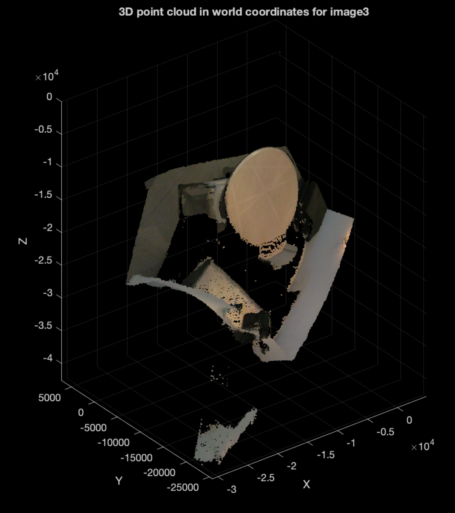
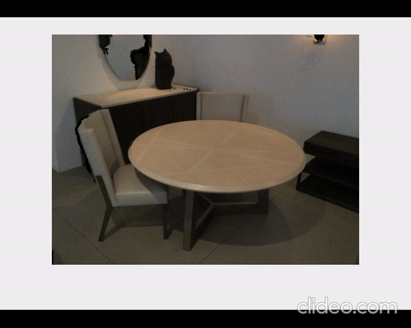

# Point Cloud

There are 4 matlab file in this folder:

Compute_2d_projection.m: Given RGB and depth image, rotation angle, translation vector and intrinsics matrix. compute the projected image after applying the translation and rotaion to the object.

Compute_point_cloud_camera.m: compute 3D point cloud in camera frame with 2d image and depth map provided.

Compute_point_cloud.m: compute 3D point cloud in world frame with 2d image and depth map provided, and stores matrix in .mat file.

Test_projection.m: calls Compute_2d_projection many times to apply different rotation and translation and save its projected image.

### To use compute_point_cloud:

Run compute_point_cloud(imageNumber) directly, the function will store the matrix to a mat file.

### To use compute_2D_projection: 

open test_projection.m , set number of frame(steps) you want to compute, rotating angle per step and translation vector per step. The function will show and store both projected RGB image and depth image to you.

### Sequence of Rotations and Translations

Test_projection.m can be used to generate a sequence of frames by keeping applying rotation and translations to a points cloud.

